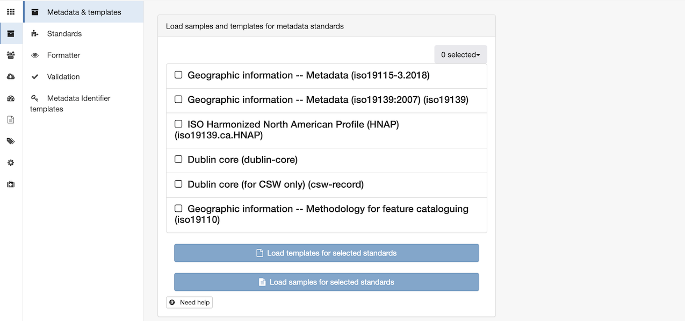
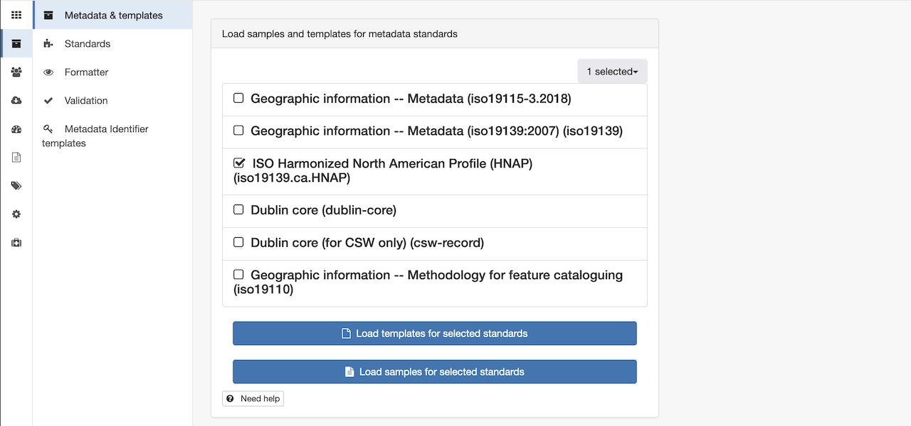
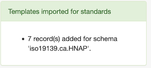
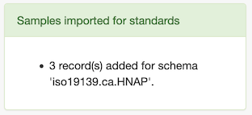
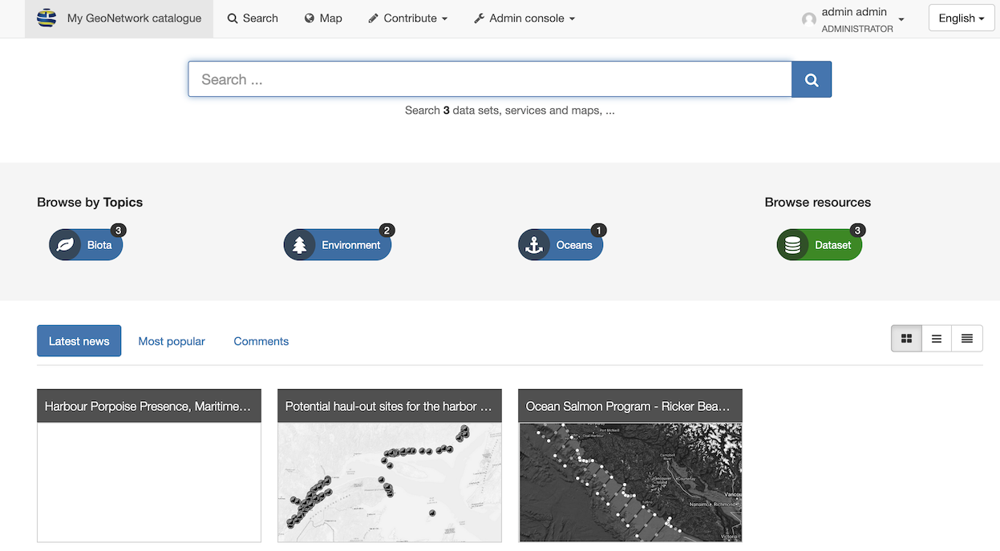

# Installation

!!! info "Reference"
    
    [Quickstart](https://geonetwork-opensource.org/manuals/3.12.x/en/user-guide/quick-start/index.html) (GeoNetwork 3.12 Documentation)

## Schema plugin installation

!!! note "GeoNetwork version to use with this plugin"

    Use GeoNetwork ``3.12.x``, not tested with prior versions!

    The schema plugin editor makes use of a number of controls for editing structured
    text fields requiring newer releases of core-geonetwork.

The plugin can be deployed manually in an existing GeoNetwork installation:

1. Stop geonetwork

2. Download from [releases](https://github.com/metadata101/iso19139.ca.HNAP/releases) page.
   
    * **`schema-iso19139.ca.HNAP.zip`**
    * **`schema-iso19139.ca.HNAP.jar`**
    * **`schema-iso19139.ca.HNAP-docs.zip`**

3. Extract contents of the **`schema-iso19139.ca.HNAP.zip`** download into **`WEB-INF/data/config/schema_plugins/iso19139.ca.HNAP`**.

4. Copy the **`schema-iso19139.ca.HNAP.jar`** to geonetwork **`WEB-INF/lib`**

5. Copy the **`schema-iso19139.ca.HNAP`** doc to geonetwork **`doc`**

6. Restart geonetwork.

    ??? info

        There is some custom initialization code run when GeoNetwork starts up:

        1. The plugin includes will check the GeoNetwork Data Directory `ThesauriDir` to see if the HNAP Thesauruses are already installed.

        2. If these files re not present (i.e. this is the very first run of GeoNetwork with the HNAP Schema), the required thesaurus files are are copied from the **`jar`** into to the correct location in the Data Directory.

## Initial setup

1. Navigate to **Admin console > Metadata and templates**.

    
    *Metadata and templates*

2. On the **Metadata & templates** page, select `ISO Harmonized North American Profile (HNAP) (iso19139.ca.HNAP)`
   from the list of available document schemas.

    
    *HNAP schema selected*

3. Optional: Press **Load templates for selected standards**.

    
    *Templates loaded*

    Templates are a useful starting point when creating new content, you may use the ones provided or create new templtes for your team.

4. Optional: Press **Load samples for selected standards**.

    
    *Samples loaded*
    
5. Navigate to **Search** to see loaded sample records.
   The documentation examples assume these samples are available.
   
    
    *Samples search*
