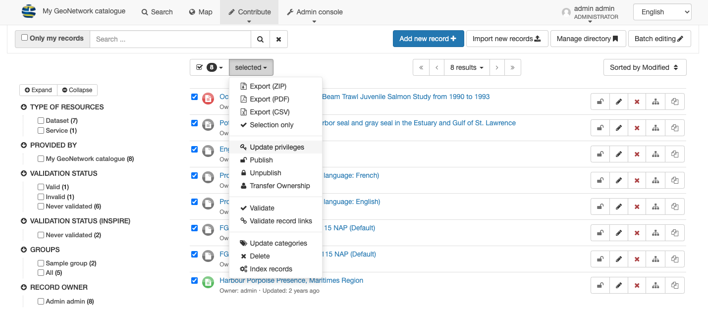

# Record Privileges

## Records Privileges

Selecting one or more records provides an opportunity to adjust the
privileges controlling what activities are available. Privileges are
provided to each group for fine grain control of record access.

References:

-   `Managing privileges <community/user-guide/publishing/managing-privileges.html>`{.interpreted-text
    role="manual"}

Manage group records editing access:

1.  Navigate to the `Contribute --> Editor board`{.interpreted-text
    role="menuselection"}.

2.  Select checkbox `GROUPS`{.interpreted-text role="guilabel"} and
    `Sample Group`{.interpreted-text role="guilabel"} to list all the
    records in group.

3.  At the start of the listed records locate the checkbox dropdown, and
    select `All`{.interpreted-text role="guilabel"}. This fills in the
    checkbox box next to each record on all of the records listed.

    
    *Select all listed records*

4.  Use the `selected`{.interpreted-text role="guilabel"} drop-down to
    select `Update privileges`{.interpreted-text role="guilabel"} for
    the selected records.

    
    alt="img/group_selected_update_privileges.png" />
    *Update privileges*

5.  Fill in privileges for the following groups:

    -   \`All\`: publish permissions to view published records.

        Built-in \"group\" representing visitors to the website.

    -   \`Intranet\`: publish and download permissions to view and
        download published records.

        Built-in group for authenticated users. Represents organization
        staff who have signed into the catalog and been authenticated.

    -   \`Guest\`: publish permission to view published records.

        Built-in group for website guests who have created their own
        account.

    -   \`Staff\`: Set-all privileges.

        Group used to give editing permissions to a select group of
        individuals, staff in this example, who have signed into the
        catalog and been authenticated as members.

    
    *Record privileges*

6.  Update record permissions using
    `Replace by selected`{.interpreted-text role="guilabel"}.

    This may take some moments to complete.

## Examples

Example of interaction between record group and record privileges:

-   For a record with [publish]{.title-ref} privilege in [Sample
    Group]{.title-ref}, any user assigned to the SampleGroup will be
    able to view the record.
-   For a record with [editing]{.title-ref} privilege in [Sample
    Group]{.title-ref}, any user assigned to the SampleGroup with
    [Editor]{.title-ref} or [Reviewer]{.title-ref} profile with be able
    to edit.
