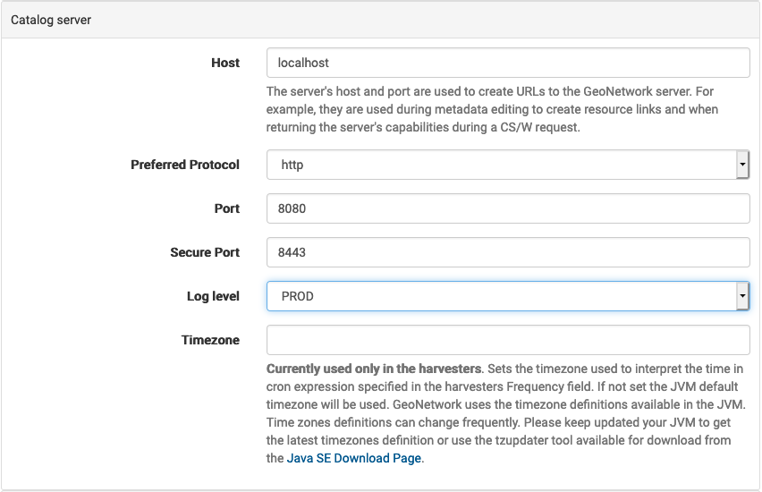
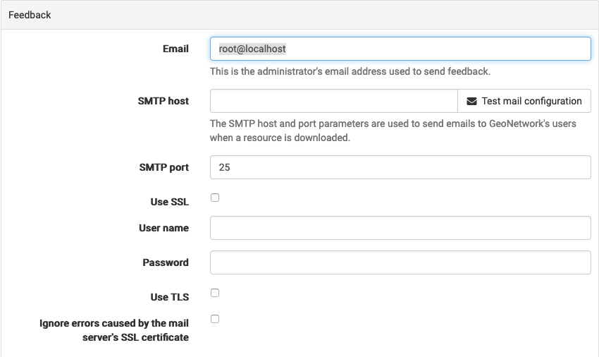
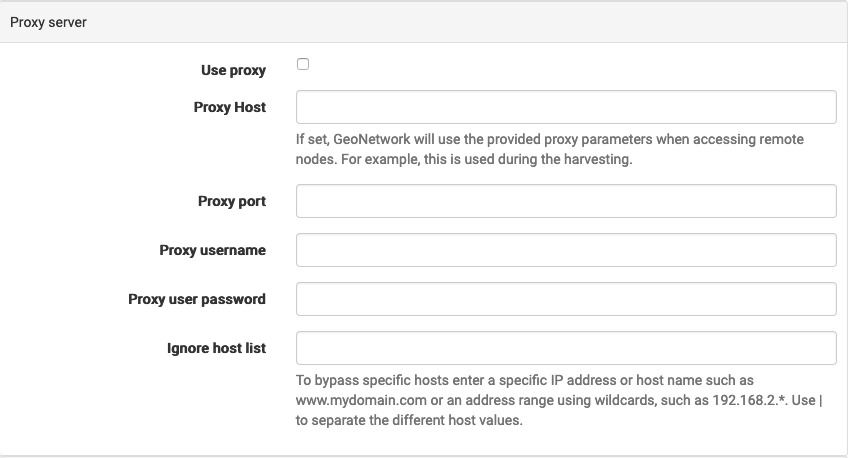
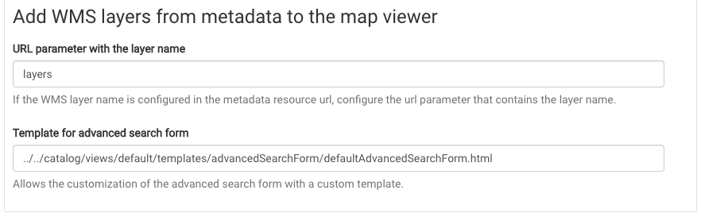

# Settings

## Settings: System

Common *Admin Console > Settings* to review from the *Settings* page:

1.  Catalog server:

    -   Network details: Update to accurately identify this web service.
    -   Log level: Change level of detail reported for troubleshooting,
        return to `PROD` for general use.

    
    *Catalog server*

2.  Feedback: mail configuration

    
    *Feedback settings.*

3.  Proxy server: optional proxy used to allow geonetwork to access
    external web services.

    
    *Proxy service*

4.  A subset of settings for *Admin Console > Settings*
    are required for validation and managed during application startup.

    Site:

    -   system/site/name
    -   system/site/organization

    Schema settings:

    -   schema/iso19139.ca.HNAP/DefaultMainOrganizationName_en
    -   schema/iso19139.ca.HNAP/UseGovernmentOfCanadaOrganisationName
    -   schema/iso19139.ca.HNAP/DefaultMainOrganizationName_fr
    -   system/metadata/validation/removeSchemaLocation

    See initialization file **`initialization/settings/settings.json`** for details.

## Settings: User Interface

Settings for  *Admin Console > Settings* page *UI Settings*:

-   HNAP adds a `layers=\<name\>` parameter to the GetCapabilities URL used to document a WMS Service

    To support this functionality locate
    *Add WMS layers from metadata to the map viewer* heading, and change the
    *URL parameter with the layer name* to `layers`.

    
    *HNAP setting for URL parameter*
