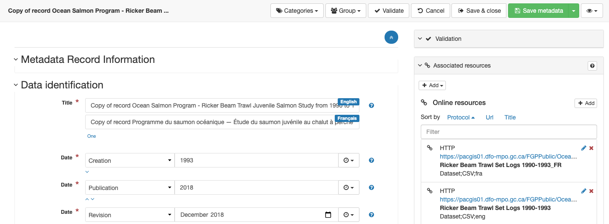

# Create

## Create Record

1.  To create a new record navigate to
    `Contribute --> Editor board`{.interpreted-text
    role="menuselection"}.

    Click the `Add new record`{.interpreted-text role="guilabel"}
    button.

    
    *Editor board*

    !!! Note

        The contribute menu requires editor permission, talk to your
        administrator if you require increased access.

2.  Using the `Add a new record`{.interpreted-text role="guilabel"}
    screen to select a template for your new record, and use
    `Create`{.interpreted-text role="guilabel"}.

    
    *Add a new record*

## Duplicate record

1.  To create a new record navigate to
    `Contribute --> Editor board`{.interpreted-text
    role="menuselection"}.

    
    *Editor board*

    !!! note

        The contribute menu requires editor permission, talk to your
        administrator if you require increased access.

2.  Locate a record to duplicate, and use the
    `Duplicate`{.interpreted-text role="guilabel"} button (at the far
    right of the record actions row).

    
    alt="img/editor_board_duplicate.png" />
    *Record duplicate*

3.  Double check the `Add a new record`{.interpreted-text
    role="guilabel"} options and use `Create`{.interpreted-text
    role="guilabel"} to duplicate the record.

    
    alt="img/add_record_duplicate.png" />
    *Add a new record*

4.  The new record is opened in the editor.

    The new record is generated with a generated identifier and title to
    avoid conflict with the original.

    
    alt="img/duplicate_record_editor.png" />
    *Metadata editor showing duplicate record*

## Create Template

Templates are used as a start point for the creation of new records, and
do not appear as part of search results.

To create a template:

1.  Choose an example record to start from and duplicate the record as
    shown in the previous section.

2.  Update the title to be clear this is a template.

3.  When saving a record you use the drop down arrow to select
    `Save as template`{.interpreted-text role="guilabel"}

    
    *Save as template*

## Delete Record

1.  To delete a new record navigate to
    Contribute > Editor board.

    
    *Editor board*

    !!! note

        The contribute menu requires editor permission, talk to your
        administrator if you require increased access.

2.  Locate record to delete, and use the `Delete`{.interpreted-text
    role="guilabel"} button in the record actions.

    
    *Record delete*

3.  Confirm removing the record.

    
    alt="img/record_delete_confirm.png" />
    *Record delete confirmation*
