# Edit

## Edit record

1.  There are several ways to open the record editor when viewing a
    record:

    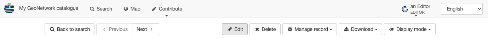
    *Record view edit*

2.  The record editor is started using the
    *Basic view*, showing the
    document title, current editor status, and a toolbar of editor
    actions.

    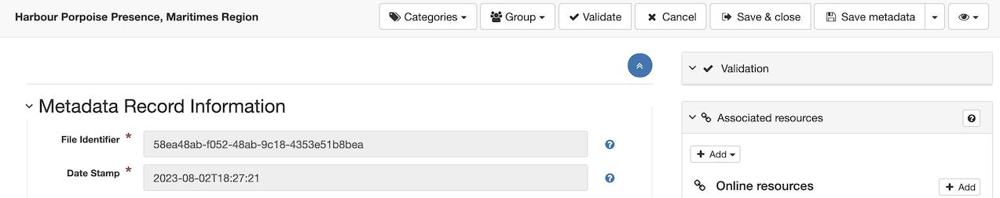
    *Record editor basic view*

3.  The *Categories* dropdown shows
    the categorization of the record. To update use the checkboxes to
    assign one or more categories to the record.

    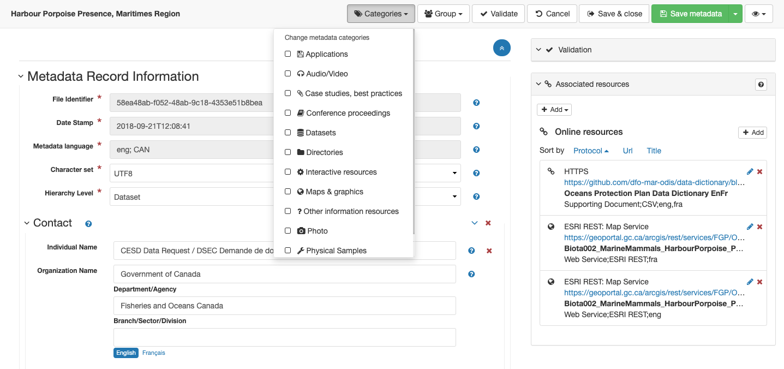
    *Change metadata Categories*

4.  Use the *Group* to show the group
    containing the record. To update use the radio button to transfer
    the record to a different group.

    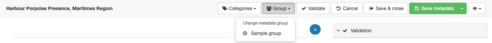
    *Change metadata group*

5.  Use the *Validate* button to
    check the structure and contents of the record.

    Validation feedback is shown on the right-hand side of the screen.

    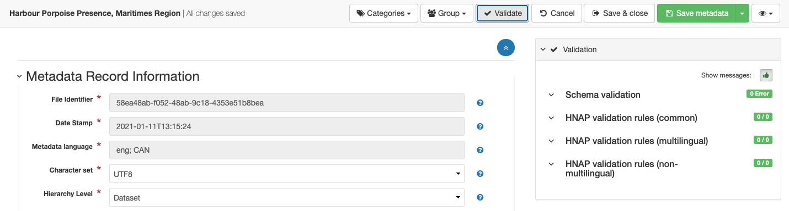
    *Record validation*

6.  Editing is completed using:

    -   *Cancel :fontawesome-solid-xmark:* to abandon any
        changes and return to viewing record.
    -   *Save & close :fontawesome-solid-right-from-bracket:* to apply
        changes and return to viewing record.
    -   *Save metadata :fontawesome-regular-floppy-disk:* to apply
        changes and continue editing

    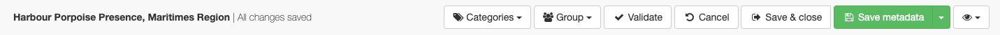
    *Record apply, save and cancel options*

7.  Use the *View mode :fontawesome-regular-eye:* (at the top
    of the screen on the far right) to choose the editor you would like
    to use.

    -   Basic view
    -   Advanced view
    -   XML view

    Options to toggle tooltips and show more detail adjust how the
    editor is shown.

8.  *Basic view* is recommended and
    provides easy access to the most commonly required fields.

    Basic view is often used when editing an existing document.

    
    *Display mode basic view*

9.  The *Tooltips* and
    *More details* are used to toggle
    additional options for field editing.

    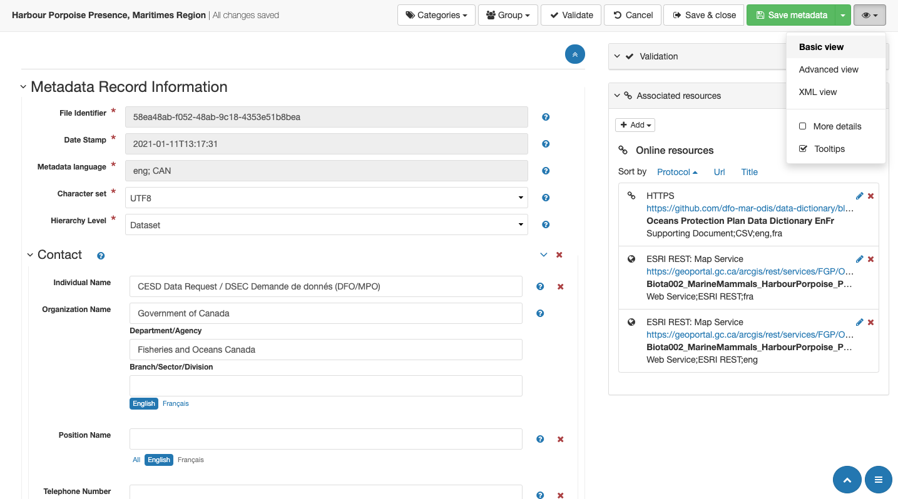
    *Basic view with tooltips and more detail turned
    off.*
    
10. *Advanced view* provides greater control over document structure,
    with *\+* buttons to add additional information.

    Advanced view is often used to add new sections when creating a
    document from scratch.

    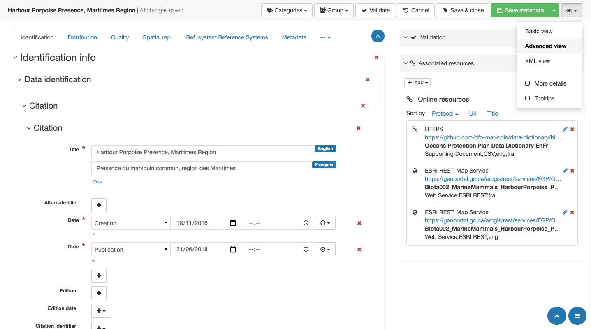
    *Display mode advanced view*

11. *XML view* is used to review the machine readable `xml` content.

    The XML view is almost exclusively used for troubleshooting and is
    not recommended for content creation.

    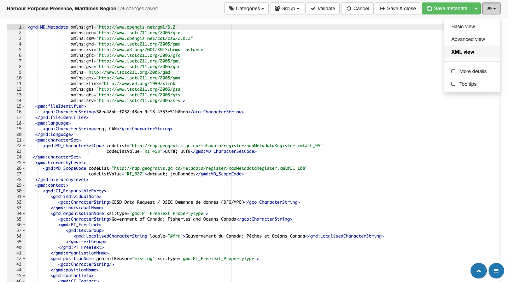
    *Display mode xml view*

12. Tips and tricks for editing records:

    -   To edit directly from search results use the
        *Edit* button (shown as a pencil icon below).

        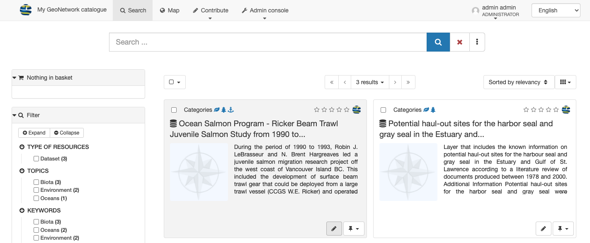
        *Search results edit*

## Editor navigation

1.  Records are divided into a series of nested sections covering
    different subjects.

    Each section has a heading, use the `v` toggle next to each
    heading to hide and show the section contents.

    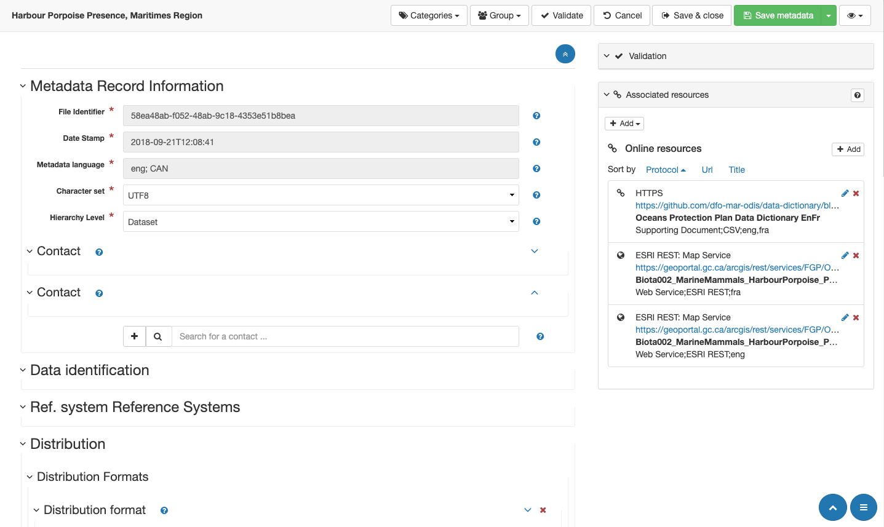
    *Record headings*

2.  A overview of *Metadata record information* providing quick
    navigation is available at the bottom right of the page.

    -   Click on a heading to jump to that section of the record.
    -   As you scroll the overview will update to show the headings on
        screen in bold.

    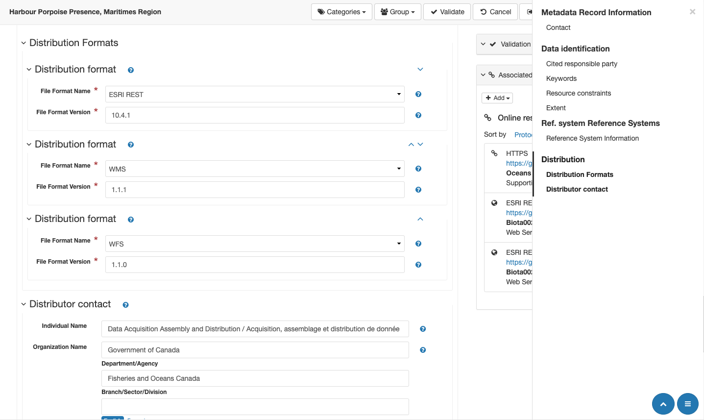
    *Metadata record information.*

3.  The bottom right of the screen also includes a
    *Scroll to top* button.

## Editor fields

1.  Record editing make use of data entry fields consisting of:

    -   Label naming field content
    -   Text field for data entry
    -   *Delete this field* button to remove optional content.
    -   *Tooltip* shown as a question mark ?* icon, describing field.

    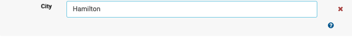
    *Text field.*

2.  Mandatory fields are labeled with a asterisk *\** icon:

    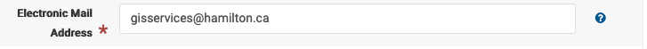
    *Mandatory field*

3.  Fields that cannot be edited are shown grayed out.

    
    *Non-editable field*

4.  To access tooltip information hover mouse pointer over the
    question mark *?* icon.

    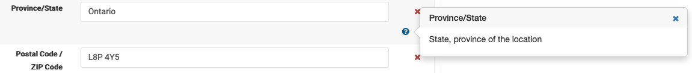
    *Field tool tip*

5.  Use *Delete this field* to remove optional fields.

    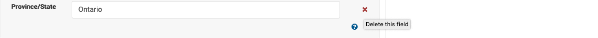
    *Delete this field*

6.  Text fields are used for data entry.

    
    *Text field.*

7.  Some text fields with a large number of options offer the ability to
    type or search to narrow down valid suggestions.

    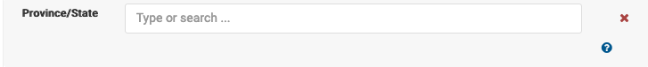
    *Type or search field*

8.  Select fields are used to choose between a limited number of options:

    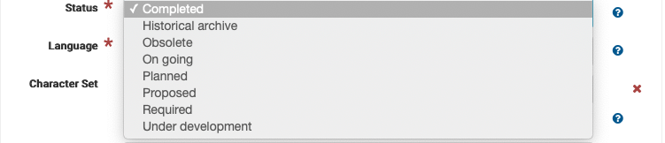
    *Select field*

    !!! note
    
        Occasionally these fields will show an empty line, where a value
        has not been provided yet.

## Optional vs Nil

1.  Optional values, can be removed using *Delete this field :fontawesome-solid-xmark:* button.

    This button can be used to remove the *Country* field from and address.

    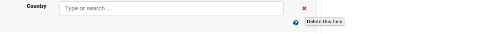
    *Delete optional country field*

    This field is no longer included in the record (and may be re-added
    if needed using the Advanced view).

2.  Advanced: Fields can also be filled in as `Nil` by opening up the *View mode*
    at the top of the screen and selected *More details* checkbox.

    This provides additional *Nil reason* buttons that can be used to add one or more reasons
    why a value cannot be provided.

    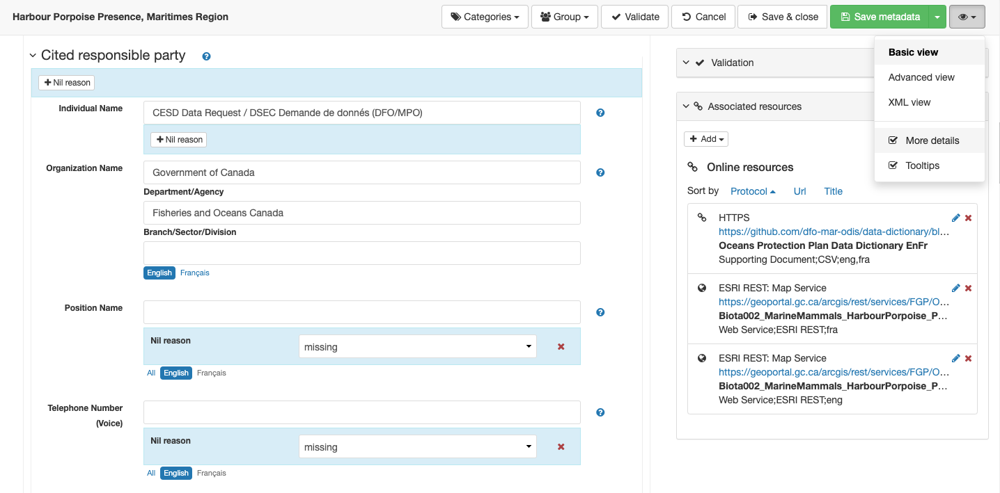
    *Email address witheld*

    !!! note

        Be careful marking mandatory fields as Nil, as the resulting record
        may not be considered valid.

## WMS Service Links

1.  Edit record locate the *Associated resources* box on the right hand side of the editor.

    Navigate to the *Online resources* heading, and press *Add* button to open
    *Link an online resource* dialog.

2.  Change *Protocol* to select
    `OGC:WMS`.

3.  Provide the GetCapabilities URL for the WMS Service:

    -   Start with the GetCapabilities URL provided by the service
        publishing content.

        Generally of the form
        `http://localhost:8080/geoserver/ows?service=wms&version=1.3.0&request=GetCapabilities`.

    -   Append the parameter `&layers=name` to indicate the layer to
        display.

        Review the raw GetCapabilities document to see all the layers
        available in the service, layers are indicated using:

        ``` xml
        <Layer queryable="1">
           <Name>0</Name>
           <Title>National Tornado Events</Title>
           ...
        ```

        To visually explore the GetCapabilities use a Desktop GIS
        application, or the included Map Viewer.

        As shown above many ESRI WMS services tend to name layers using
        numbers `layers=0`, resulting in:

        `http://localhost:8080/geoserver/ows?service=wms&version=1.3.0&request=GetCapabilities&layers=0`

        HNAP supports naming several layers `layers=habitat,study_area` from the same WMS
        service.

4.  Use *Resource name* to provide
    the title of the layer in English and French.

    The raw GetCapabilities document included the title of the layer:

    ``` xml
    <Layer queryable="1">
       <Name>0</Name>
       <Title>National Tornado Events</Title>
       ...
    ```

5.  The description is broken up into three components, for
    `OGC:WMS` the following are appropriate:
    
    *Content type*
    :   `Web Service`

    *Format*
    :   `WMS`

    *Language*
    :   Indicate if the resource is displayed with `eng` labels,
        `fra` labels, or mixed `eng;fra` content.

        For WMS services which detect language dynamically adjust labels
        dynamically `eng;fra` is appropriate.

6.  Use *Function* to select `Web Service` (as the function performed by the WMS).

7.  If known the *Application profile* can be used to formally mark WMS services
    supporting specific WMS profiles (Open Search, Earth Observation,
    Temporal, INSPIRE, MapML).

8.  Tips:

    -   When viewing the record use *Add to Map* functionality to verify
        the web service link is correct.

## Thumbnail generation

1.  Navigate to the *Online resources* heading, and press *Add* button to open
    *Link an online resource* dialog.

2.  At the top of the dialog, select *Add a thumbnail*.

    -   The available files, including any previously generated
        thumbnails are listed in the *Metadata file store*.
    -   The *Generate thumbnail using the view service* is used
        to generate new thumbnails.

3.  Use the *Generate thumbnail using the view service*:

    -   The *Layout* and *Scale* is used to define the capture area.

        The capture area is displayed as a light area providing a clear
        representation of the thumbnail to be generated.

        Adjust the scale first until the capture area encloses your
        content, and then adjust the layout for an aspect ratio that
        matches the arrangement of your content.

    -   Use the mouse to pan the area shown and the scroll wheel to
        adjust content displayed within the capture area

    When ready press *Generate thumbnail* to save a new image.

4.  Return to the *Metadata file store* and locate your new thumbnail:

    -   Preview using *Open resource*
    -   You can use *Delete resource* if the image is not quite correct,
        and generate replacement thumbnail.

5.  Select the thumbnail to update the *Overview* displayed for the record.

6.  The thumbnail can be downloaded by visitors, use
    *Resource name* to provide an english and french filename for this image.
