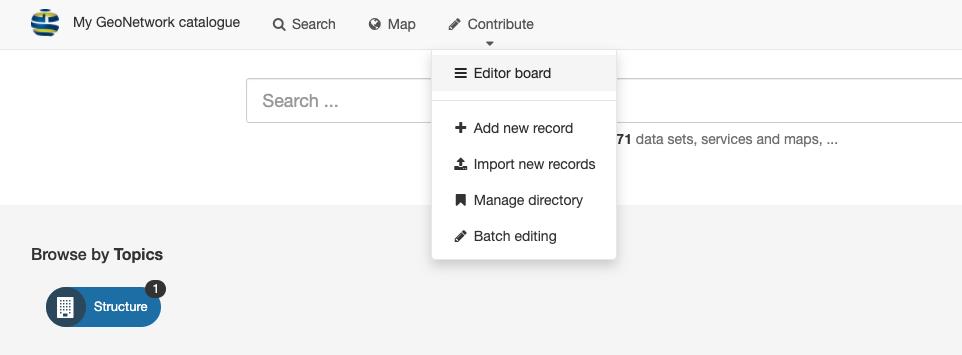
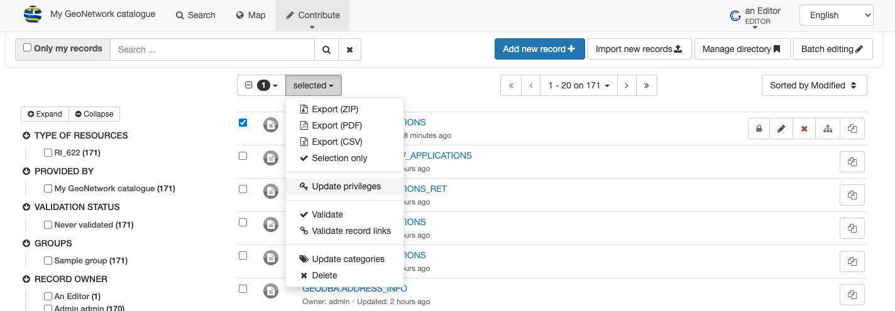
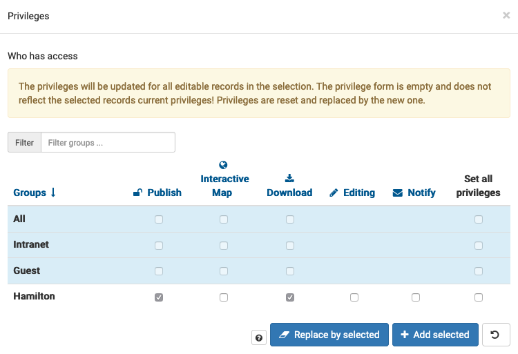
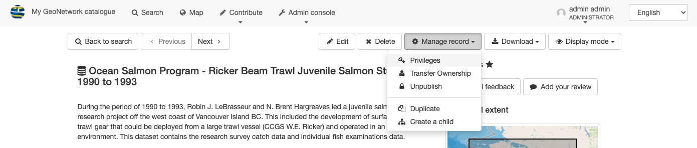
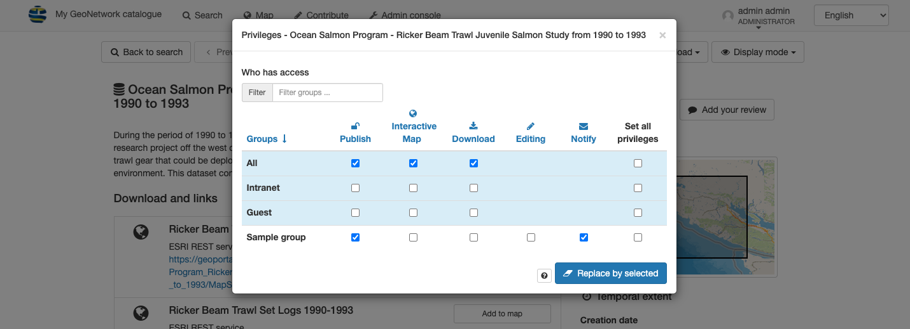
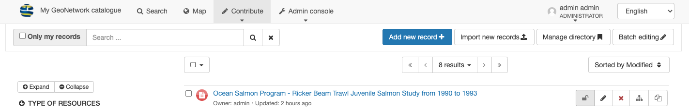

# Publish

Publishing a record is accomplished by adjusting the privileges of
different groups to view the record.

## Publish records

1.  To adjust privileges navigate to
    *Contribute > Editor board*.

    
    *Editor board*

    !!! note

        The contribute menu requires editor permission, talk to your
        administrator if you require increased access.

2.  Use the checkboxes to select more than one record, and choose
    *Update privileges*.

    
    *Update privileges for selected records*

3.  Adjust the privileges for viewing and downloading record content.

    
    *Allow record view and download*

    !!! note

        You may only be able to adjust privileges for a limited set of
        groups you have access to.

4.  Apply the new privileges:

    -   *Add selected* to add
        additional privileges

    -   *Replace by selected* to
        redefine set of privileges.

        !!! warning

            This option is to be used carefully as it can removes existing
            access. This is a popular way to lock yourself out of a record
            and require administrator assistance.

## Publish record

1.  To update privileges when viewing a record select
    *Mange record > Privileges* from the toolbar at the top of the page.

    
    *Manage record*

2.  Adjust the privileges for viewing and downloading record content.

    
    *Allow record view and download*

    !!! note

        You may only be able to adjust privileges for a limited set of
        groups you have access to.

3.  Use *Replace by selected* to
    redefine set of privileges.

    !!! warning

        This option is to be used carefully as it can removes existing
        access. This is a popular way to lock yourself out of a record and
        require administrator assistance.

4.  Tips and tricks for publishing a record:

    -   From the *Contribute > Editor board* locate an individual record and press the *Publish* button.

        
        *Record privileges*
