# Validation

Records are defined using the North American Profile (NAP) which lays
out the structure of the document, as well as checking how some of the
values interact. Validating a document checks that are record is
complete.

While invalided or partially complete records can be useful, validation
is an important step in confirm the records are machine readable.

-   Schema validation is used to check the structure of the document,
    reporting on required elements, and if elements are in the
    prescribed order.
-   Schematron validation rules are used to double check the document
    values, and how values interact. As an example a schematron rule
    will check that the organization name is \"Government of Canada\".

Technically we are working from the from the \"Harmonized\" North
American Profile (HNAP) which has some Canadian checks for multi-lingual
content.

## Editor Validation

To validate a document from the editor:

1.  Select the validate button at the top of the page.

    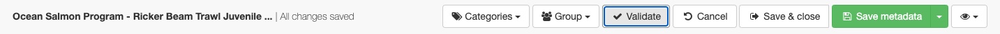
    *Running validation from the editor*

2.  Feedback about the document structure (schema validation) is
    provided in the editor inline near the field which is incorrect.

    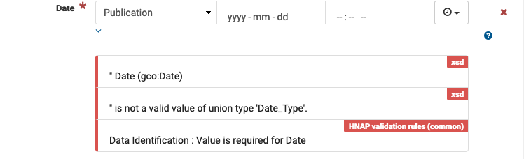
    alt="img/schema-validation-date.png" />
    <figcaption>Data identification publication date is
    required.</figcaption>

    In the example above the [xsd]{.title-ref} errors represent issues
    with the document structure. And the [HNAP validation rules
    (common)]{.title-ref} provide feedback from checking document
    contents.

3.  Feedback about document contents (schematron validation) is provided
    in the editor along the right hand side.

    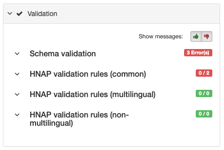

    This reports the number of rules failed, if the rule is associated
    with a specific field (like the date check above) the message is
    shown in the editor near the problem. If the rule is checking the
    values are consistent between fields the message is shown here on
    the right hand side.

## Data identification

1.  To resolve data identification missing a publication date.

    
    alt="img/schema-validation-date.png" />
    <figcaption>Data identification publication date is
    required.</figcaption>

    Fill in a date value, there are options to provide a year, year and
    month, or a complete date.

    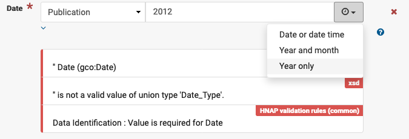
    *Defining publication date as 2012*

    A calendar is provided when filling in a date, or date time.

    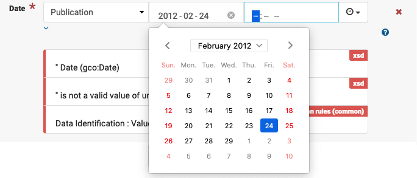
    *Use of calendar to select a publication date*

2.  The same approach can be used data identification missing a creation
    date.

    !!! tip

        Take care that creation date is before publication date.

3.  To correct data identification status \"Value is required for
    status\".

    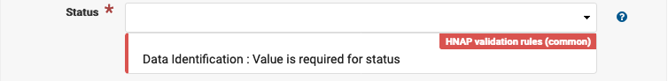
    *Value is required for status*

    Select one of the values from the drop down list, a tooltip provides
    the definition of each value.

4.  To correct data identification missing topic category.

    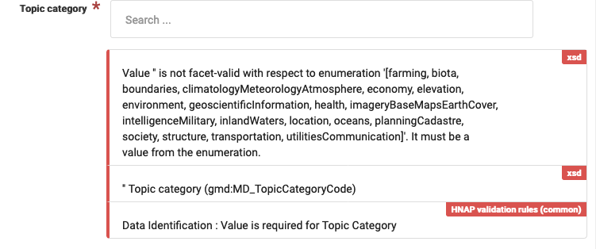
    *Data identification topic category is required*

    Start typing to see the predefined topic categories provided by the
    north american profile.

    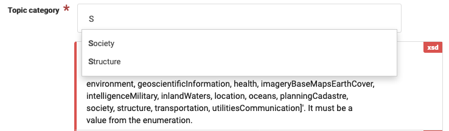
    alt="img/topic_categories_predefined.png" />
    *Autocomplete topic categories*

    Multiple topic categories can be used.

5.  This one is a little tricky, data identification \"core subject
    thesaurus keywords are manditory\".

    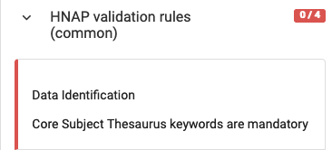
    alt="img/core_subject_keywords.png" />
    *Core subject keywords are required*

    This checks that the keywords section includes at least one
    describing the record subject using a list provided by the Canadian
    government.

    Locate the [Choose keywords from thesaurus]{.title-ref} actions, and
    choose [Government of Canada Core Subject Thesaurus]{.title-ref}
    from the list.

    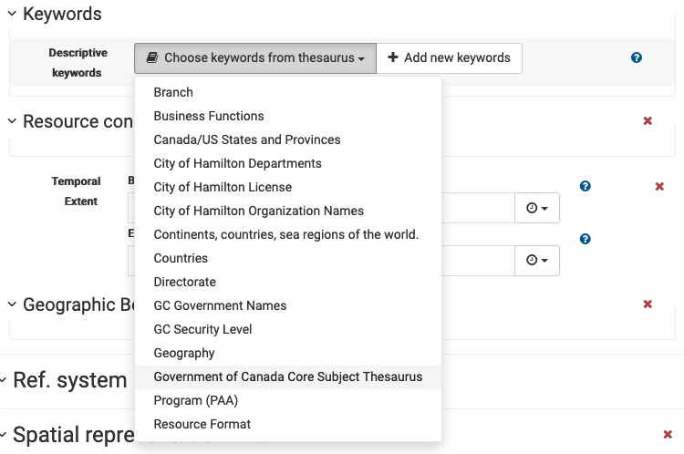
    alt="img/keyword-add-core-subject.png" />
    *Choose keywords from a thesaurus*

    Locate the heading for core subject thesaurus, and start typing to
    select one or more predefined keywords.

    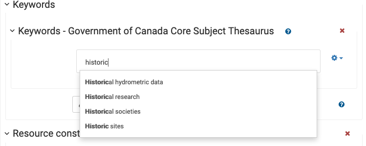
    *Historic subject recommendations*

## Cited responsible party

1.  To fix cited responsible party missing email address.

    > Cited responsible party requires email address

    Fill in email address.

    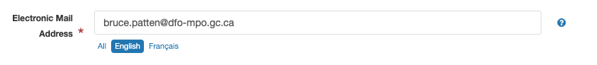

## Resource constraints

1.  To address resource constraints missing temporal extent begin date
    or end date.

    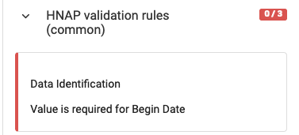
    *Value is required for Begin Date*

    Use the `Begin Date`{.interpreted-text role="guilabel"} and
    `End Date`{.interpreted-text role="guilabel"} fields to define the
    temporal extent. These values can be provided numerically for
    [year]{.title-ref} and\` year and month\`, or using a calendar to
    define [date \`and \`date and time]{.title-ref}.

    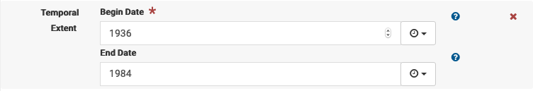
    alt="img/resource_date_range.png" />
    *Temporal extent begin and end date.*

## Distribution

1.  To address distribution format missing file format and version
    details.

    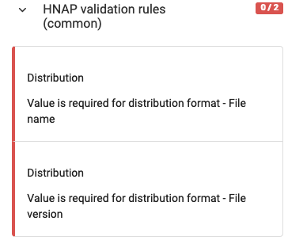

    Locate `Distribution --> Distribution Formats`{.interpreted-text
    role="menuselection"} heading. Each dataset may be available in
    several different formats, this message requires us to be very
    specific about the file format used providing both the format name
    and verison number.

    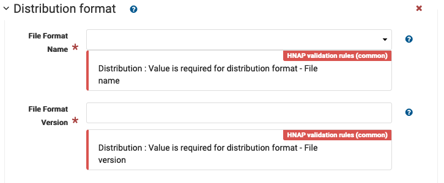
    alt="img/distribution_format.png" />
    <figcaption>Distribution format requires file format and file
    version</figcaption>

    Select a file format from the list, and enter a file version number:

    -   [zip]{.title-ref}

    The filename extension can often be used to determine format name,
    you may need to check the document properties to determine the
    specific version.

    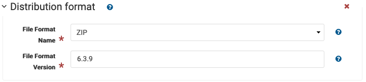
    <figcaption>File format zip version 6.3.9</figcaption>

    Examples:

    -   `pdf`{.interpreted-text role="file"} version [1.4]{.title-ref}
        as reported using operating system properties
    -   `zip`{.interpreted-text role="file"} version [2.0]{.title-ref}
        using `zipinfo`{.interpreted-text role="command"} command line,
        apparently the zip format is still being developed with
        [6.3.9]{.title-ref} being the latest 2020 release.

2.  To fix distributor contact organization name.

    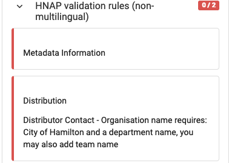

    The organization name is defined in three parts:

    -   [Government of Canada]{.title-ref} is required
    -   A department name, type in an approriate value (or choose an
        autocomplete option)
    -   A team or group name, optional

    For this record we are supplying
    `Tourism and Culture`{.interpreted-text role="kbd"}.

    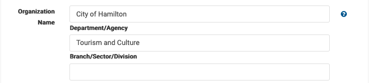
    alt="img/organization_name_fixed.png" />
    *Organization name*
