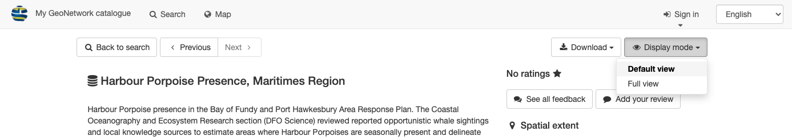
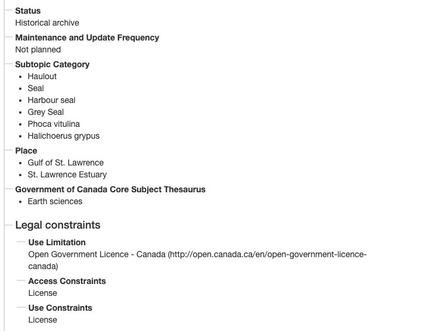
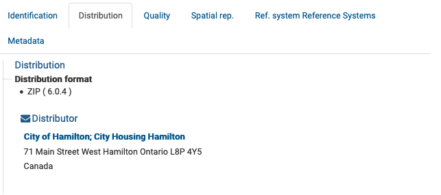
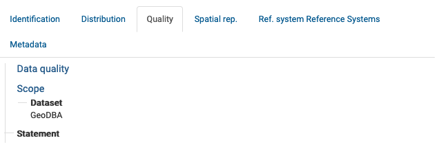

# View Record

View record contents to discovering more in depth details about record
and the dataset described.

Locate record to view:

1.  Use search field `Ocean`{.interpreted-text role="kbd"}.

2.  Locate the record with title [Ocean]{.title-ref}, and click on the
    record to view.

    The background of the record will change to gray when your mouse is
    over the [Accommodations]{.title-ref} record.

    
    *Search Ocean*

3.  The record contents are displayed, using the initial
    `Default View`{.interpreted-text role="guilabel"} display mode.

    
    alt="img/record_default_view.png" />
    *Accomidations default view*

4.  Record actions for viewing and download:

    -   `Next`{.interpreted-text role="guilabel"} and
        `Previous`{.interpreted-text role="guilabel"} buttons used to
        review search results.
    -   `Download`{.interpreted-text role="guilabel"} used to
        `export record <Download from record view>`{.interpreted-text
        role="ref"} as `ZIP`{.interpreted-text role="file"},
        `XML`{.interpreted-text role="file"} or `PDF`{.interpreted-text
        role="file"}
    -   The `Display mode`{.interpreted-text role="guilabel"} drop-down
        to change between [Default View]{.title-ref} and [Full
        View]{.title-ref} covered in the next section.

    
    *Record actions*

## Default View

The `Default view`{.interpreted-text role="guilabel"}, provides a quick
summary of record contents:

1.  Use `Display mode`{.interpreted-text role="guilabel"} to change to
    [Default view]{.title-ref}.

    
    *Change display mode to default view*

2.  Record title and description are shown at the top of the page.

    
    *Record description*

3.  `About this resource`{.interpreted-text role="guilabel"} provides
    information on the contents, such as topic category.

    
    *About this resource*

4.  `Technical information`{.interpreted-text role="guilabel"} provides
    details such data format.

    
    *Technical information*

5.  `Metadata information`{.interpreted-text role="guilabel"} provides a
    button to download the XML record, contact information, and the
    unique identifier.

    
    *Metadata information*

6.  On the right hand side:

    -   `Spatial extent`{.interpreted-text role="guilabel"} is shown
        visually on a map
    -   Information on updates and feedback.

    
    alt="img/record_default_view.png" />
    *Accomidations default view*

## Full View

The `Full view`{.interpreted-text role="guilabel"} is used to show
complete record contents.

1.  Use `Display mode`{.interpreted-text role="guilabel"} to change to
    [Full view]{.title-ref}.

    > Change display mode to full view

2.  The advanced view divides the record up into a number of tabs:

    -   Identification
    -   Distribution
    -   Quality
    -   Spatial Representation
    -   Reference Systems
    -   Metadata

3.  The `Identification`{.interpreted-text role="guilabel"} tab
    provides:

    -   Citation information:

        
        
        *Citation details*
    -   Status and legal constraints (such as the Data Dissemination
        Policy).

        
        
        *Abstract and keywords*
    -   Additional information including temporal and spatial extent

        
        
        *Additional identification information*
    
4.  The `Distribution`{.interpreted-text role="guilabel"} tab has
    details on how the content can be accessed.

    
    *Data distribution details*

5.  The `Quality`{.interpreted-text role="guilabel"} tab lists data
    quality information.

    
    *Data quality details*

6.  The `Spatial rep.`{.interpreted-text role="guilabel"} tab provides a
    summary of the spatial representation.

    
    alt="img/spatial_representation.png" />
    *Spatial representation details*

7.  The `Reference System`{.interpreted-text role="guilabel"} tab covers
    information on the spatial reference system used.

    This is provided as a machine readable
    [http://www.opengis.net/def/crs/EPSG/0/26917]{.title-ref} reference
    to the [NAD83 / UTM zone 17N]{.title-ref} reference system.

8.  The `Metadata`{.interpreted-text role="guilabel"} tab covers the
    unique File Identifier, providing a link to view the XML document,
    along with point of contact information for the record.

    
    *Record metadata details*

## XML Record

1.  The XML record can be shown:

    -   `Default View`{.interpreted-text role="guilabel"} metadata
        heading provides a `Download metadata`{.interpreted-text
        role="guilabel"} button.

        
        
        *Default view download metadata*
    
2.  `Full View`{.interpreted-text role="guilabel"} metadata tab provides
    a link to `XML`{.interpreted-text role="guilabel"}.

    > 
    > 
    > alt="img/full_download_metadata.png" />
    > *Full view download metadata*
    > 

3.  The XML file is downloaded, or shown directly in your browser.

    
    *XML download shown in FireFox*

4.  Keep in mind XML record does not include any attached documents or
    thumbnails.

    To download complete record information see the
    `download`{.interpreted-text role="doc"} section.
