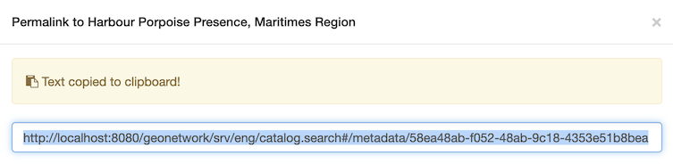

# Download record

Multiple metadata records can be exported for download.

## Download from search results

To select records from multiple search results:

1.  Use the `Search`{.interpreted-text role="guilabel"} field at to
    enter: `Accommodations`{.interpreted-text role="kbd"}

    
    *Search results for Accommodations*

2.  Use the checkboxes next to each record to select the contents for
    download.

    
    alt="img/download_select_records.png" />
    *Select records for download*

3.  At the top of the page the number of selected records is shown.

4.  Next to the number of selected records is a
    `selected`{.interpreted-text role="guilabel"} drop-down, offering a
    number of export options for download.

5.  `Export (ZIP)`{.interpreted-text role="guilabel"} archive including
    `xml`{.interpreted-text role="file"} records along with any
    attachments and thumbnails.

    The resulting file includes:

    -   A folder for each metadata record exported

    -   `index.html`{.interpreted-text role="file"} summary of contents

        
        *Export ZIP index summary*

    -   `index.csv`{.interpreted-text role="file"} summary of contents

        
        *Export ZIP csv summary*

6.  `Export (PDF)`{.interpreted-text role="guilabel"} document of
    exported records.

    
    *Export PDF in Firefox*

7.  `Export (CSV)`{.interpreted-text role="guilabel"} download providing
    a tabular summary of exported records.

    
    
    *Export CSV*

## Download from record view

Download the contents of a single record.

1.  Open the [Accommodations]{.title-ref} record, showing a number of
    download options:

    
    *Record download options*

2.  `Permalink`{.interpreted-text role="guilabel"} provides a URL that
    can be shared via email or message.

    
    *Permalink to GEODBA.ACCOMMODATIONS record*

    Use `Control-C`{.interpreted-text role="kbd"} to copy text to
    clipboard:

    
    *Permalink copied*

3.  `Export (ZIP)`{.interpreted-text role="guilabel"} archive including:

    -   A folder containing complete `metadata.xml`{.interpreted-text
        role="file"} record, and simplified
        `metadata-iso19139.xml`{.interpreted-text role="file"} record.
    -   `index.html`{.interpreted-text role="file"} and
        `index.csv`{.interpreted-text role="file"} summary described in
        the previous section.

    
    *Export (ZIP) index.html summary*

    This file is useful for exchanging information between systems. The
    archive contents follows the Metadata Exchange Format convention
    used to share records between catalogs.

4.  `Export (PDF)`{.interpreted-text role="guilabel"} document.

    
    *Export (PDF) document*

5.  `Export (XML)`{.interpreted-text role="guilabel"} machine readable
    document.

    
    *XML download shown in FireFox*

6.  `Export (RDF)`{.interpreted-text role="guilabel"} machine readable
    definition of vocabulary used.

    This file is useful for exchanging information between systems.
