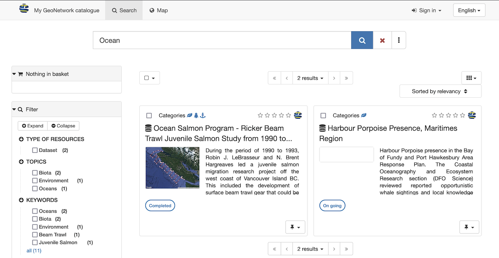
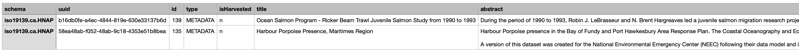
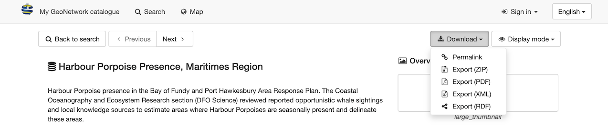
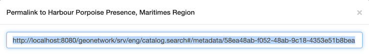
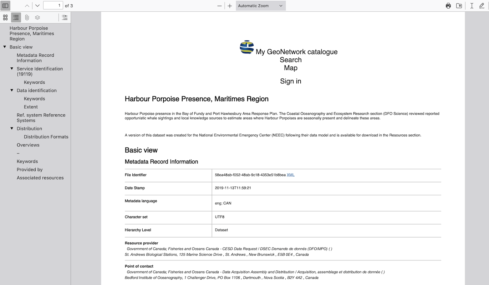

# Download record

Multiple metadata records can be exported for download.

## Download from search results

To select records from multiple search results:

1.  Use the *Search* field to enter: `Accommodations`

    
    *Search results for Accommodations*

2.  Use the checkboxes next to each record to select the contents for
    download.

    
    alt="img/download_select_records.png" />
    *Select records for download*

3.  At the top of the page the number of selected records is shown.

4.  Next to the number of selected records is a
    *selected* drop-down, offering a
    number of export options for download.

5.  *Export (ZIP)* archive including `xml` records along with any
    attachments and thumbnails.

    The resulting file includes:

    -   A folder for each metadata record exported

    -   **`index.html`** summary of contents

        
        *Export ZIP index summary*

    -   **`index.csv`** summary of contents

        
        *Export ZIP csv summary*

6.  *Export (PDF)* document of
    exported records.

    
    *Export PDF in Firefox*

7.  *Export (CSV)* download providing
    a tabular summary of exported records.

    
    
    *Export CSV*

## Download from record view

Download the contents of a single record.

1.  Open the *Accommodations* record, showing a number of download options:

    
    *Record download options*

2.  *Permalink* provides a URL that
    can be shared via email or message.

    
    *Permalink to GEODBA.ACCOMMODATIONS record*

    Use ++control+c++ (or ++command+c++ on macOS) to copy text to clipboard:

    
    *Permalink copied*

3.  *Export (ZIP)* archive including:

    -   A folder containing complete **`metadata.xml`** record, and simplified
        **`metadata-iso19139.xml`** record.
    -   **`index.html`** and **`index.csv`** summary described in
        the previous section.

    
    *Export (ZIP) index.html summary*

    This file is useful for exchanging information between systems. The
    archive contents follows the Metadata Exchange Format convention
    used to share records between catalogs.

4.  *Export (PDF)* document.

    
    *Export (PDF) document*

5.  *Export (XML)* machine readable
    document.

    
    *XML download shown in FireFox*

6.  *Export (RDF)* machine readable
    definition of vocabulary used.

    This file is useful for exchanging information between systems.
