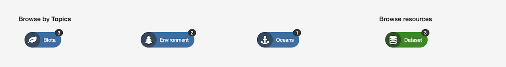
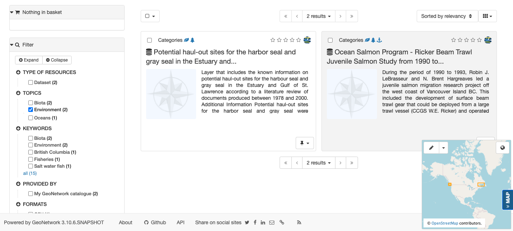

# Search records

The GeoNetwork catalog provides a data portal listing datasets and
resources.

## Search Catalogue

1.  Enter the desired keywords and search terms into the *Search* field
    at the top of the page and use ++enter++, or the *Search* button, to
    list search results.

    
    *Search field*

2.  Search for complete words: `Ocean`.

    
    *Search results for Ocean*

3.  The wildcard `*` is used to match the start or end of word: `Area*`

    Keep in mind the entire record contents is searched, not only the
    titles and description.

    
    *Search for start of a word*

4.  The wildcard `*` can also be used multiple times to match part of a word: `*resea*`

    
    *Search for part of a word*

## Browse Catalogue

1.  The catalog page can be explored using the quick lists of:

    -   *Latest news*: recently updated records
    -   *Most popular*: frequently used records
    -   *Comments*: records with new comments and discussion

    
    *Latest news*

2.  Records are displayed as a block list, large list, or small list
    using the toggle on the right.

    Click on any of the listed records to view.

    
    *Large list display of records*

3.  The catalog page provides a number of quick searches to browse
    catalog contents:

    -   Use *Browse by Topics* to
        explore records based on subject matter.
    -   Use *Browse by Resources* to
        explore different kinds of content.

    Each option lists "search facets" (shown as small bubbles), click
    on a "search facet" such as `Dataset` to explore.

    
    *Browse metadata catalogue*

4.  Clicking on a "search facet" (`Environment` in this example) lists
    matching records.

    
    *Search facet*

## Search Results

To further explore listed records:

1.  Use the *Filter* section on the right hand side to refine your search
    using additional search facets, keywords, and details such as download format.

    
    *Filter results*

2.  Options are provided along the top to control the presentation of
    the matching records (as a grid or list) and advance to additional
    pages of results.

    
    *Browse results*

3.  *Advanced search options* are located in the *...* menu next to the
    *Search* field at the top of the page. These options can be
    used to further refine search results by category, keywords, contact
    or date range.

    
    *Advanced search options*

4.  Use the *Advanced search options* panel, the drop down for
    *Records created in the last* to select `this week`.

    This acts as a short cut to fill in the from and to calendar fields.
    Press the *Search* button to filter using this date range.

    
    *Records updated in the last week*

    !!! note

        The *Record* date filter shows records with data identification
        (creation, publication, revision) dates included within the
        calendar date range.

        The *Resource* date filter is not presently used.

5.  To search for records in the year `2012` use the advanced search
    options to fill in:

      --------------------- -------------------------------------------------
      From                  `2012-01-01`

      To                    `2012-12-31`
      --------------------- -------------------------------------------------

    Press *Search* button to show records from `2012`.

    
    *Records updated in 2012*

6.  A slide out map is provided at the bottom of the page, providing
    visual feedback on the extent of each record.

    
    *Search map*

    The map can be controlled by by toggling beween two modes:

    -   Bounding Box: Click and drag to define an extent used to filter
        records. The drop down controls if the extent is used to list
        only records that are withing, or all records that intersect.
    -   Pan: Click and drag the map location, using the mouse wheel to
        adjust zoom level.

7.  Records are selected (using the checkbox located next to each one)
    to quickly download or generate a PDF of one or more records.

    
    *Selected Records*

8.  Additional tips and tricks with search results:

    -   Details on
        [selecting multiple records and exporting](download.md#download-from-search-results)
        as a `ZIP` or `PDF`.
    -   Editors have additional options to [edit](../editor/edit/index.md) and
        [manage](../editor/publish/index.md) records.
